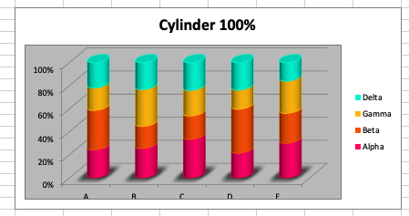
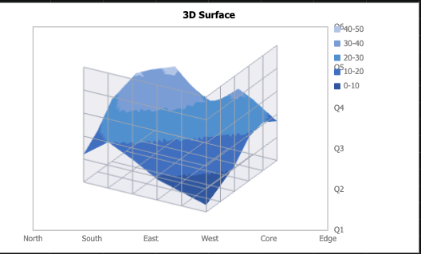
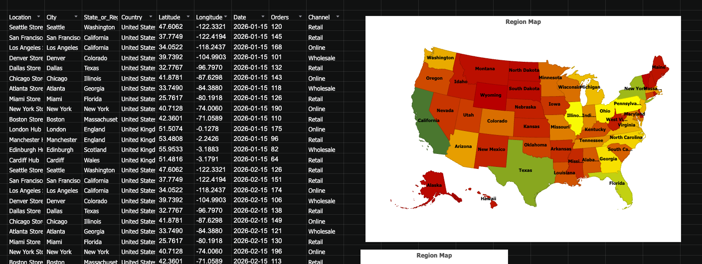

# react-xlsx

[](https://www.npmjs.com/package/@extend-ai/react-xlsx)

Private npm package: `@extend-ai/react-xlsx`

`react-xlsx` provides React components and hooks for viewing XLSX workbooks with worksheet rendering, charts, chartsheets, embedded images, selection state, zoom, and editing helpers.

## Install

```bash
pnpm add @extend-ai/react-xlsx
```

## What It Supports

- Regular worksheet rendering with frozen panes, tables, and selection state
- Embedded charts on worksheets and dedicated chartsheet tabs
- Embedded worksheet images with custom render hooks
- Inline controller usage or provider-driven composition with hooks
- Large-file safeguards, deferred loading, and worker-backed parsing
- Optional editing, copy/paste, CSV/XLSX export, chart/image manipulation, and zoom controls
- Primary support is for OOXML `.xlsx` workbooks
- Legacy `.xls` and macro-enabled `.xlsm` workbooks have limited support: the viewer only displays workbook data that `@dukelib/sheets-wasm` can parse, and format-specific XML features may be missing or skipped

## Quick Start

### Minimal Viewer

```tsx
import { XlsxViewer } from "@extend-ai/react-xlsx";

export function WorkbookPreview({ buffer }: { buffer: ArrayBuffer }) {
  return (
    <XlsxViewer
      file={buffer}
      fileName="quarterly-report.xlsx"
      height={600}
      showDefaultToolbar
    />
  );
}
```

### Provider + Hooks

Use `XlsxViewerProvider` when the rest of your UI needs access to workbook state.

```tsx
import {
  DefaultXlsxToolbar,
  XlsxViewer,
  XlsxViewerProvider,
  useXlsxViewerSelection,
} from "@extend-ai/react-xlsx";

function SelectionBadge() {
  const { activeCellAddress, selectedRangeAddress } = useXlsxViewerSelection();
  return <div>{selectedRangeAddress ?? activeCellAddress ?? "No selection"}</div>;
}

export function WorkbookWorkspace({ buffer }: { buffer: ArrayBuffer }) {
  return (
    <XlsxViewerProvider file={buffer} fileName="model.xlsx">
      <DefaultXlsxToolbar />
      <SelectionBadge />
      <XlsxViewer height="70vh" showDefaultToolbar={false} />
    </XlsxViewerProvider>
  );
}
```

## `XlsxViewer` Props

`XlsxViewerProps` includes all controller options plus viewer-only rendering props.

### Source And Loading Props

| Prop | Type | Notes |
| --- | --- | --- |
| `file` | `ArrayBuffer` | Local XLSX bytes to load directly. |
| `src` | `string` | Remote workbook URL. |
| `fileName` | `string` | Optional display/download name override. |
| `controller` | `XlsxViewerController` | Uses an existing controller instead of creating one internally. If present, it takes precedence over provider context and source props on the viewer itself. |
| `useWorker` | `boolean` | Enables worker-backed parsing. Defaults to `true`. |
| `deferLoadingAboveBytes` | `number` | Defers parsing above this byte threshold. Defaults to `0` (disabled). |
| `maxFileSizeBytes` | `number` | Hard parse limit before rendering a too-large state. Defaults to `25 * 1024 * 1024` (`25 MB`). |
| `readOnly` | `boolean` | Forces viewer editing features off. Defaults to `false`. |
| `readOnlyAboveBytes` | `number` | Automatically switches large workbooks into read-only mode above this threshold. Defaults to `0` (disabled). |
| `skipXmlParsing` | `boolean` | Skips the OOXML ZIP/XML parsing layer and relies only on `Workbook.fromBytes(...)` metadata from `@dukelib/sheets-wasm`. The viewer also auto-enables this mode for legacy `.xls` files when their OLE magic bytes are detected. This is effectively the limited-support path used for `.xls` and some `.xlsm` content, so only data Duke Sheets can parse will render. Defaults to `false`. |

### Layout And Appearance Props

| Prop | Type | Notes |
| --- | --- | --- |
| `className` | `string` | Applied to the root viewer shell. |
| `height` | `React.CSSProperties["height"]` | Fixed or fluid height for the viewer container. |
| `isDark` | `boolean` | Enables the built-in dark viewer palette. |
| `rounded` | `boolean` | Toggles the default rounded outer shell. Defaults to `true`. |
| `showDefaultToolbar` | `boolean` | Shows or hides the built-in toolbar. Defaults to `true`. |
| `enableGestureZoom` | `boolean` | Enables pinch-to-zoom and modifier-key (`Cmd`/`Ctrl`) scroll-to-zoom inside the viewer. Defaults to `true`. |
| `allowResizeInReadOnly` | `boolean` | Allows row and column resizing even when `readOnly` is enabled. Defaults to `false`. |
| `experimentalCanvas` | `boolean` | Routes the worksheet renderer through the experimental canvas implementation. Defaults to `false`. |
| `toolbar` | `React.ReactNode \| (controller: XlsxViewerController) => React.ReactNode` | Replaces the toolbar area with a custom node or render function. |
| `selectionColor` | `string` | Border/accent color for the current selection. |
| `selectionFillColor` | `string` | Fill color used for selection overlays. |
| `selectionHeaderColor` | `string` | Accent color used for selected row/column headers. |
| `showImages` | `boolean` | Toggles worksheet image rendering. Defaults to `true`. |

### Custom State And Render Hooks

| Prop | Type | Notes |
| --- | --- | --- |
| `emptyState` | `React.ReactNode` | Rendered when no workbook is loaded. |
| `loadingComponent` | `React.ReactElement` | Full loading replacement component. |
| `loadingState` | `React.ReactNode` | Loading fallback content. |
| `errorState` | `React.ReactNode \| (error: Error) => React.ReactNode` | Custom error UI. |
| `fileTooLargeState` | `React.ReactNode \| (props: XlsxFileTooLargeRenderProps) => React.ReactNode` | Custom oversized-file UI. When provided and the limit is hit, this replaces the built-in viewer chrome. |
| `renderChartLoading` | `(props: XlsxChartLoadingRenderProps) => React.ReactNode` | Replaces the default chart-loading placeholder. |
| `renderImage` | `(props: XlsxImageRenderProps) => React.ReactNode` | Replaces how worksheet images render. |
| `renderImageSelection` | `(props: XlsxImageSelectionRenderProps) => React.ReactNode` | Replaces the selected-image overlay and resize handles. |
| `renderTableHeaderMenu` | `(props: XlsxTableHeaderMenuRenderProps) => React.ReactNode` | Replaces the built-in table column menu. |

## `XlsxViewerProvider` Props

`XlsxViewerProvider` accepts all `UseXlsxViewerControllerOptions` plus:

| Prop | Type | Notes |
| --- | --- | --- |
| `children` | `React.ReactNode` | Descendant UI that should share the viewer controller. |
| `controller` | `XlsxViewerController` | Optional externally created controller. |
| `isDark` | `boolean` | Exposes the dark/light appearance context to children such as `DefaultXlsxToolbar`. |

## Useful Hooks

These hooks are exported from the package and work inside `XlsxViewer` or `XlsxViewerProvider` context.

| Hook | Returns | Use For |
| --- | --- | --- |
| `useXlsxViewer()` | `XlsxViewerController` | Full controller access. |
| `useXlsxViewerSelection()` | `XlsxViewerSelection` | Active cell and range state. |
| `useXlsxViewerZoom()` | `XlsxViewerZoom` | Zoom controls and limits. |
| `useXlsxViewerEditing()` | `XlsxViewerEditing` | Editing, undo/redo, fill, merge, and paste actions. |
| `useXlsxViewerTables()` | `XlsxViewerTables` | Table metadata and sorting actions. |
| `useXlsxViewerImages()` | `XlsxViewerImages` | Embedded image and chart positioning/manipulation. |
| `useXlsxViewerCharts()` | `XlsxViewerCharts` | Chart and chartsheet access. |

## Oversized File Example

```tsx
import { XlsxViewer } from "@extend-ai/react-xlsx";

<XlsxViewer
  file={buffer}
  maxFileSizeBytes={50 * 1024 * 1024}
  fileTooLargeState={({ displayFileName, fileSizeBytes, maxFileSizeBytes }) => (
    <div>
      <strong>{displayFileName}</strong> is too large to open here.
      <div>
        {Math.round(fileSizeBytes / (1024 * 1024))} MB of {Math.round(maxFileSizeBytes / (1024 * 1024))} MB allowed
      </div>
    </div>
  )}
/>
```

Notes:

- `maxFileSizeBytes` defaults to `25 MB`
- The file-size check runs before parsing
- If you pass a custom `fileTooLargeState`, that custom node becomes the rendered oversized-file state

## Supported Chart Families

The viewer currently renders these chart families directly from workbook chart definitions:

- Column and bar: clustered, stacked, percent stacked, plus styled Excel variants that normalize into those families
- Line and area: regular, stacked, and percent stacked
- Scatter: markers, straight-line, and smooth-line variants
- Pie family: pie, exploded pie, 3D pie, doughnut, and bar-of-pie
- Other common charts: radar, bubble, stock, and surface / 3D surface
- Extended charts: waterfall, funnel, box-and-whisker, sunburst, treemap, and region map
- Combo charts: mixed column + line combinations when both groups are present in the workbook
- Chartsheets: standalone chart tabs render alongside worksheet tabs

If a workbook contains a chart type outside those renderers, the viewer falls back to an explicit unsupported-chart placeholder instead of silently failing.

### Example: Styled Cylindrical Columns

This example shows a workbook using Excel-styled cylindrical stacked columns. Internally these still map into the column/bar rendering family.



### Example: 3D Surface Chart

Surface charts, including 3D surface-style workbooks, render as dedicated surface plots instead of flattening into a generic image placeholder.



### Example: Region Map

Filled geographic region maps are supported for workbook data that resolves cleanly to state or country features.



## Exported Types

The package also exports the main types you are likely to use for custom integrations:

- `UseXlsxViewerControllerOptions`
- `XlsxViewerProps`
- `XlsxViewerProviderProps`
- `XlsxViewerController`
- `XlsxViewerSelection`
- `XlsxViewerZoom`
- `XlsxViewerEditing`
- `XlsxViewerTables`
- `XlsxViewerImages`
- `XlsxViewerCharts`
- `XlsxChart`, `XlsxChartSeries`, `XlsxChartAxis`, `XlsxChartsheet`
- `XlsxImage`, `XlsxImageRect`, `XlsxImageRenderProps`, `XlsxImageSelectionRenderProps`
- `XlsxTable`, `XlsxTableColumn`, `XlsxTableHeaderMenuRenderProps`
- `XlsxWorkbookTab`, `XlsxCellAddress`, `XlsxCellRange`

## Notes

- `XlsxViewer` resolves its controller in this order: explicit `controller` prop, provider context, then an internally created controller
- `DefaultXlsxToolbar` is exported if you want the library toolbar outside the default shell
- The npm badge tracks the synced GitHub release version while the package remains private on npm
